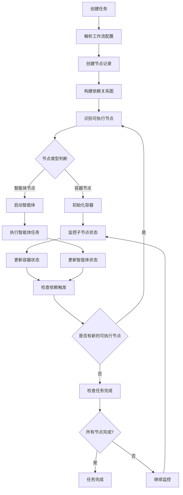

# Deduction 模块重新设计 - 支持工作流模式

**创建时间**: 2025-11-13
**模块名称**: Deduction (推导执行模块)
**设计版本**: v2.0

---

## 一、设计背景

### 1.1 需求变更
- 前端界面采用**工作流形式**配置方案
- 存在两种节点类型：
  - **容器节点** (Container Node): 管理内部容器/智能体的状态
  - **智能体节点** (Agent Node): 负责具体执行任务
- 节点间存在层级关系和依赖关系
- 执行单位是容器和智能体的综合版本

### 1.2 节点结构示例
```json
{
  "isRoot": true,        // 是否根节点
  "isBox": false,        // 是否容器节点 (true=容器, false=智能体)
  "id": "uniqueId",      // 节点唯一标识
  "father": null,        // 父节点ID
  "agentLoad": "...",    // 智能体加载名称(仅智能体节点)
  "pin": {...},          // 执行触发条件
  "activation": {...}    // 激活条件
}
```

---

## 二、重新设计的数据库表结构

### 2.1 表关系概览

```
deduction_task (推导任务表)
    └── workflow_node (工作流节点表)
            ├── node_execution (节点执行实例表)
            │   └── node_execution_log (节点执行日志表)
            ├── node_dependency (节点依赖关系表)
            └── node_state_transition (节点状态转换记录表)
```

---

### 2.2 核心表定义

#### 表1: `deduction_task` (推导任务表)
**用途**: 记录每次方案执行的任务信息

```python
class DeductionTask(Base):
    """推导任务表"""
    __tablename__ = "deduction_task"

    # 主键和外键
    id: Mapped[snowflake_id_key] = mapped_column(
        sa.BigInteger, primary_key=True, comment="任务ID"
    )
    scheme_id: Mapped[int] = mapped_column(
        sa.BigInteger, sa.ForeignKey("scheme.id"), comment="方案ID"
    )
    env_instance_id: Mapped[int] = mapped_column(
        sa.BigInteger, sa.ForeignKey("env_instance.id"), comment="环境实例ID"
    )

    # 任务基本信息
    name: Mapped[str] = mapped_column(
        sa.String(128), unique=True, comment="任务名称"
    )
    description: Mapped[str | None] = mapped_column(
        sa.String(512), nullable=True, comment="任务描述"
    )

    # 工作流相关
    workflow_snapshot: Mapped[dict] = mapped_column(
        sa.JSON, comment="工作流配置快照(完整的节点图)"
    )
    root_node_id: Mapped[str | None] = mapped_column(
        sa.String(128), nullable=True, comment="根节点ID"
    )

    # 状态管理
    status: Mapped[str] = mapped_column(
        sa.String(32),
        default="pending",
        comment="任务状态: pending/initializing/running/paused/completed/failed/stopped"
    )

    # Engine 交互
    engine_task_id: Mapped[str | None] = mapped_column(
        sa.String(128), nullable=True, comment="引擎侧任务ID"
    )
    engine_url: Mapped[str | None] = mapped_column(
        sa.String(256), nullable=True, comment="Engine服务地址"
    )

    # 时间字段
    start_time: Mapped[datetime | None] = mapped_column(
        TimeZone, nullable=True, comment="开始时间"
    )
    end_time: Mapped[datetime | None] = mapped_column(
        TimeZone, nullable=True, comment="结束时间"
    )

    # 统计信息
    total_nodes: Mapped[int] = mapped_column(
        sa.Integer, default=0, comment="节点总数"
    )
    total_containers: Mapped[int] = mapped_column(
        sa.Integer, default=0, comment="容器节点数"
    )
    total_agents: Mapped[int] = mapped_column(
        sa.Integer, default=0, comment="智能体节点数"
    )
    completed_nodes: Mapped[int] = mapped_column(
        sa.Integer, default=0, comment="已完成节点数"
    )
    failed_nodes: Mapped[int] = mapped_column(
        sa.Integer, default=0, comment="失败节点数"
    )
    running_nodes: Mapped[int] = mapped_column(
        sa.Integer, default=0, comment="运行中节点数"
    )

    # 错误信息
    error_message: Mapped[str | None] = mapped_column(
        sa.Text, nullable=True, comment="错误信息"
    )

    # 审计字段
    create_at: Mapped[datetime] = mapped_column(
        TimeZone, default=timezone_now, comment="创建时间"
    )
    update_at: Mapped[datetime] = mapped_column(
        TimeZone, default=timezone_now, onupdate=timezone_now, comment="更新时间"
    )
```

---

#### 表2: `workflow_node` (工作流节点表)
**用途**: 定义工作流中的所有节点（容器和智能体）

```python
class WorkflowNode(Base):
    """工作流节点表"""
    __tablename__ = "workflow_node"

    # 主键和外键
    id: Mapped[snowflake_id_key] = mapped_column(
        sa.BigInteger, primary_key=True, comment="节点记录ID"
    )
    deduction_task_id: Mapped[int] = mapped_column(
        sa.BigInteger,
        sa.ForeignKey("deduction_task.id", ondelete="CASCADE"),
        comment="所属任务ID"
    )

    # 节点标识
    node_id: Mapped[str] = mapped_column(
        sa.String(128), comment="节点业务ID(前端生成的唯一ID)"
    )

    # 节点类型
    node_type: Mapped[str] = mapped_column(
        sa.String(32), comment="节点类型: container/agent"
    )
    is_root: Mapped[bool] = mapped_column(
        sa.Boolean, default=False, comment="是否根节点"
    )

    # 层级关系
    parent_node_id: Mapped[str | None] = mapped_column(
        sa.String(128), nullable=True, comment="父节点ID"
    )
    level: Mapped[int] = mapped_column(
        sa.Integer, default=0, comment="节点层级(0为根节点)"
    )

    # 智能体信息（仅agent类型节点）
    agent_meta_id: Mapped[int | None] = mapped_column(
        sa.Integer,
        sa.ForeignKey("agent_meta.id"),
        nullable=True,
        comment="智能体元数据ID"
    )
    agent_load: Mapped[str | None] = mapped_column(
        sa.String(128), nullable=True, comment="智能体加载名称"
    )
    agent_url: Mapped[str | None] = mapped_column(
        sa.String(256), nullable=True, comment="智能体下载URL"
    )

    # 容器信息（仅container类型节点）
    container_name: Mapped[str | None] = mapped_column(
        sa.String(128), nullable=True, comment="容器名称"
    )
    container_type: Mapped[str | None] = mapped_column(
        sa.String(64), nullable=True, comment="容器类型"
    )

    # 配置信息
    env_config: Mapped[dict | None] = mapped_column(
        sa.JSON, nullable=True, comment="环境配置"
    )
    agent_config: Mapped[dict | None] = mapped_column(
        sa.JSON, nullable=True, comment="智能体配置参数"
    )
    biz_value: Mapped[dict | None] = mapped_column(
        sa.JSON, nullable=True, comment="业务参数"
    )

    # 执行控制
    pin_config: Mapped[dict | None] = mapped_column(
        sa.JSON, nullable=True, comment="触发条件配置"
    )
    pin_time: Mapped[datetime | None] = mapped_column(
        TimeZone, nullable=True, comment="定时触发时间"
    )
    activation_config: Mapped[dict | None] = mapped_column(
        sa.JSON, nullable=True, comment="激活条件配置"
    )

    # 状态
    status: Mapped[str] = mapped_column(
        sa.String(32),
        default="pending",
        comment="节点状态: pending/waiting/ready/running/completed/failed/stopped/skipped"
    )

    # 审计字段
    create_at: Mapped[datetime] = mapped_column(
        TimeZone, default=timezone_now, comment="创建时间"
    )
    update_at: Mapped[datetime] = mapped_column(
        TimeZone, default=timezone_now, onupdate=timezone_now, comment="更新时间"
    )

    # 索引
    __table_args__ = (
        sa.UniqueConstraint('deduction_task_id', 'node_id', name='uk_task_node'),
        sa.Index('idx_workflow_node_task_id', 'deduction_task_id'),
        sa.Index('idx_workflow_node_parent', 'parent_node_id'),
        sa.Index('idx_workflow_node_status', 'status'),
        sa.Index('idx_workflow_node_type', 'node_type'),
    )
```

---

#### 表3: `node_execution` (节点执行实例表)
**用途**: 记录每个节点的执行情况

```python
class NodeExecution(Base):
    """节点执行实例表"""
    __tablename__ = "node_execution"

    # 主键和外键
    id: Mapped[snowflake_id_key] = mapped_column(
        sa.BigInteger, primary_key=True, comment="执行实例ID"
    )
    workflow_node_id: Mapped[int] = mapped_column(
        sa.BigInteger,
        sa.ForeignKey("workflow_node.id", ondelete="CASCADE"),
        comment="工作流节点ID"
    )

    # 执行批次（支持重试）
    execution_batch: Mapped[int] = mapped_column(
        sa.Integer, default=1, comment="执行批次(重试次数)"
    )

    # Engine 交互
    engine_node_id: Mapped[str | None] = mapped_column(
        sa.String(128), nullable=True, comment="引擎侧节点ID"
    )

    # 执行状态
    status: Mapped[str] = mapped_column(
        sa.String(32),
        default="pending",
        comment="执行状态: pending/initializing/running/completed/failed/stopped/timeout"
    )

    # 执行进度
    progress: Mapped[int] = mapped_column(
        sa.Integer, default=0, comment="执行进度(0-100)"
    )

    # 容器管理状态（仅container类型）
    managed_nodes_total: Mapped[int | None] = mapped_column(
        sa.Integer, nullable=True, comment="管理的子节点总数"
    )
    managed_nodes_completed: Mapped[int | None] = mapped_column(
        sa.Integer, nullable=True, comment="已完成的子节点数"
    )

    # 时间字段
    queue_time: Mapped[datetime | None] = mapped_column(
        TimeZone, nullable=True, comment="入队时间"
    )
    start_time: Mapped[datetime | None] = mapped_column(
        TimeZone, nullable=True, comment="开始执行时间"
    )
    end_time: Mapped[datetime | None] = mapped_column(
        TimeZone, nullable=True, comment="结束时间"
    )

    # 执行耗时（毫秒）
    duration_ms: Mapped[int | None] = mapped_column(
        sa.Integer, nullable=True, comment="执行耗时(毫秒)"
    )

    # 执行结果
    result: Mapped[dict | None] = mapped_column(
        sa.JSON, nullable=True, comment="执行结果"
    )
    error_code: Mapped[str | None] = mapped_column(
        sa.String(64), nullable=True, comment="错误代码"
    )
    error_message: Mapped[str | None] = mapped_column(
        sa.Text, nullable=True, comment="错误信息"
    )

    # 资源使用情况
    cpu_usage: Mapped[float | None] = mapped_column(
        sa.Float, nullable=True, comment="CPU使用率(%)"
    )
    memory_usage: Mapped[float | None] = mapped_column(
        sa.Float, nullable=True, comment="内存使用(MB)"
    )

    # 审计字段
    create_at: Mapped[datetime] = mapped_column(
        TimeZone, default=timezone_now, comment="创建时间"
    )
    update_at: Mapped[datetime] = mapped_column(
        TimeZone, default=timezone_now, onupdate=timezone_now, comment="更新时间"
    )

    # 索引
    __table_args__ = (
        sa.Index('idx_node_execution_node_id', 'workflow_node_id'),
        sa.Index('idx_node_execution_status', 'status'),
        sa.Index('idx_node_execution_batch', 'execution_batch'),
    )
```

---

#### 表4: `node_dependency` (节点依赖关系表)
**用途**: 定义节点间的依赖关系

```python
class NodeDependency(Base):
    """节点依赖关系表"""
    __tablename__ = "node_dependency"

    # 主键
    id: Mapped[snowflake_id_key] = mapped_column(
        sa.BigInteger, primary_key=True, comment="依赖关系ID"
    )

    # 任务和节点
    deduction_task_id: Mapped[int] = mapped_column(
        sa.BigInteger,
        sa.ForeignKey("deduction_task.id", ondelete="CASCADE"),
        comment="任务ID"
    )

    # 依赖关系
    source_node_id: Mapped[str] = mapped_column(
        sa.String(128), comment="源节点ID(被依赖节点)"
    )
    target_node_id: Mapped[str] = mapped_column(
        sa.String(128), comment="目标节点ID(依赖节点)"
    )

    # 依赖类型
    dependency_type: Mapped[str] = mapped_column(
        sa.String(32),
        default="finish",
        comment="依赖类型: finish(完成后)/success(成功后)/any(任意状态)"
    )

    # 依赖条件
    condition: Mapped[dict | None] = mapped_column(
        sa.JSON, nullable=True, comment="依赖条件表达式"
    )

    # 审计字段
    create_at: Mapped[datetime] = mapped_column(
        TimeZone, default=timezone_now, comment="创建时间"
    )

    # 索引
    __table_args__ = (
        sa.UniqueConstraint('deduction_task_id', 'source_node_id', 'target_node_id', name='uk_node_dependency'),
        sa.Index('idx_dependency_task_id', 'deduction_task_id'),
        sa.Index('idx_dependency_source', 'source_node_id'),
        sa.Index('idx_dependency_target', 'target_node_id'),
    )
```

---

#### 表5: `node_execution_log` (节点执行日志表)
**用途**: 记录节点执行过程中的日志信息

```python
class NodeExecutionLog(Base):
    """节点执行日志表"""
    __tablename__ = "node_execution_log"

    # 主键和外键
    id: Mapped[int] = mapped_column(
        sa.BigInteger, sa.Identity(start=1, increment=1),
        primary_key=True, comment="日志ID"
    )
    node_execution_id: Mapped[int] = mapped_column(
        sa.BigInteger,
        sa.ForeignKey("node_execution.id", ondelete="CASCADE"),
        comment="节点执行实例ID"
    )
    workflow_node_id: Mapped[int] = mapped_column(
        sa.BigInteger,
        sa.ForeignKey("workflow_node.id", ondelete="CASCADE"),
        comment="工作流节点ID(冗余字段，便于查询)"
    )

    # 日志信息
    timestamp: Mapped[datetime] = mapped_column(
        TimeZone, comment="日志时间戳"
    )
    level: Mapped[str] = mapped_column(
        sa.String(16), comment="日志级别: DEBUG/INFO/WARNING/ERROR/CRITICAL"
    )
    message: Mapped[str] = mapped_column(
        sa.Text, comment="日志内容"
    )

    # 日志分类
    log_type: Mapped[str] = mapped_column(
        sa.String(32),
        default="execution",
        comment="日志类型: execution/system/network/resource"
    )

    # 日志来源
    source: Mapped[str | None] = mapped_column(
        sa.String(64), nullable=True, comment="日志来源模块"
    )

    # 附加数据
    extra_data: Mapped[dict | None] = mapped_column(
        sa.JSON, nullable=True, comment="额外数据"
    )

    # 审计字段
    create_at: Mapped[datetime] = mapped_column(
        TimeZone, default=timezone_now, comment="创建时间"
    )

    # 索引
    __table_args__ = (
        sa.Index('idx_node_log_execution_id', 'node_execution_id'),
        sa.Index('idx_node_log_node_id', 'workflow_node_id'),
        sa.Index('idx_node_log_timestamp', 'timestamp'),
        sa.Index('idx_node_log_level', 'level'),
        sa.Index('idx_node_log_type', 'log_type'),
    )
```

---

#### 表6: `node_state_transition` (节点状态转换记录表)
**用途**: 记录节点状态变化历史

```python
class NodeStateTransition(Base):
    """节点状态转换记录表"""
    __tablename__ = "node_state_transition"

    # 主键
    id: Mapped[int] = mapped_column(
        sa.BigInteger, sa.Identity(start=1, increment=1),
        primary_key=True, comment="记录ID"
    )

    # 关联
    workflow_node_id: Mapped[int] = mapped_column(
        sa.BigInteger,
        sa.ForeignKey("workflow_node.id", ondelete="CASCADE"),
        comment="工作流节点ID"
    )
    node_execution_id: Mapped[int | None] = mapped_column(
        sa.BigInteger,
        sa.ForeignKey("node_execution.id", ondelete="CASCADE"),
        nullable=True,
        comment="节点执行实例ID"
    )

    # 状态转换
    from_status: Mapped[str | None] = mapped_column(
        sa.String(32), nullable=True, comment="原状态"
    )
    to_status: Mapped[str] = mapped_column(
        sa.String(32), comment="目标状态"
    )

    # 转换信息
    transition_reason: Mapped[str | None] = mapped_column(
        sa.String(256), nullable=True, comment="状态转换原因"
    )
    trigger_type: Mapped[str] = mapped_column(
        sa.String(32),
        default="system",
        comment="触发类型: system/user/dependency/timeout/error"
    )

    # 时间
    transition_time: Mapped[datetime] = mapped_column(
        TimeZone, default=timezone_now, comment="转换时间"
    )

    # 操作者
    operator: Mapped[str | None] = mapped_column(
        sa.String(64), nullable=True, comment="操作者"
    )

    # 审计字段
    create_at: Mapped[datetime] = mapped_column(
        TimeZone, default=timezone_now, comment="创建时间"
    )

    # 索引
    __table_args__ = (
        sa.Index('idx_state_transition_node_id', 'workflow_node_id'),
        sa.Index('idx_state_transition_execution_id', 'node_execution_id'),
        sa.Index('idx_state_transition_time', 'transition_time'),
    )
```

---

## 三、执行流程设计

### 3.1 任务执行流程



### 3.2 节点状态机

#### 容器节点状态
```
pending → waiting → ready → initializing → running → completed/failed
                      ↑                         ↓
                      └──────── stopped ←────────┘
```

#### 智能体节点状态
```
pending → waiting → ready → running → completed/failed
                      ↑           ↓
                      └── stopped ←┘
```

### 3.3 依赖触发机制

```python
class DependencyEvaluator:
    """依赖条件评估器"""

    def evaluate_node_ready(self, node_id: str) -> bool:
        """评估节点是否满足执行条件"""
        dependencies = self.get_dependencies(node_id)

        for dep in dependencies:
            if dep.dependency_type == "finish":
                if not self.is_node_finished(dep.source_node_id):
                    return False
            elif dep.dependency_type == "success":
                if not self.is_node_successful(dep.source_node_id):
                    return False
            elif dep.dependency_type == "any":
                # 任意状态都可以触发
                pass

        return True
```

---

## 四、API 接口调整

### 4.1 创建任务接口

```http
POST /api/v1/deduction/task/create
Content-Type: application/json

Request Body:
{
  "name": "task_20251113_001",
  "description": "工作流任务",
  "scheme_id": 1234567890,
  "env_instance_id": 9876543210,
  "workflow": {
    "nodes": [
      {
        "nodeId": "root_container_001",
        "nodeType": "container",
        "isRoot": true,
        "containerName": "主控容器",
        "children": ["agent_001", "agent_002"]
      },
      {
        "nodeId": "agent_001",
        "nodeType": "agent",
        "parentId": "root_container_001",
        "agentLoad": "agent_red_team",
        "agentConfig": {...},
        "dependencies": []
      },
      {
        "nodeId": "agent_002",
        "nodeType": "agent",
        "parentId": "root_container_001",
        "agentLoad": "agent_blue_team",
        "agentConfig": {...},
        "dependencies": [
          {
            "sourceNodeId": "agent_001",
            "type": "success"
          }
        ]
      }
    ]
  }
}

Response:
{
  "code": 200,
  "message": "success",
  "data": {
    "task_id": 2025111300001,
    "status": "initializing",
    "total_nodes": 3,
    "total_containers": 1,
    "total_agents": 2
  }
}
```

### 4.2 查询节点执行状态

```http
GET /api/v1/deduction/task/{task_id}/nodes?status=running

Response:
{
  "code": 200,
  "message": "success",
  "data": {
    "nodes": [
      {
        "nodeId": "root_container_001",
        "nodeType": "container",
        "status": "running",
        "managedNodes": {
          "total": 2,
          "completed": 1,
          "running": 1
        }
      },
      {
        "nodeId": "agent_001",
        "nodeType": "agent",
        "status": "completed",
        "progress": 100,
        "startTime": "2025-11-13T10:00:00Z",
        "endTime": "2025-11-13T10:05:00Z"
      },
      {
        "nodeId": "agent_002",
        "nodeType": "agent",
        "status": "running",
        "progress": 45,
        "startTime": "2025-11-13T10:05:30Z"
      }
    ],
    "dependencies": [
      {
        "source": "agent_001",
        "target": "agent_002",
        "type": "success",
        "satisfied": true
      }
    ]
  }
}
```

---

## 五、Engine 服务交互调整

### 5.1 提交任务时的数据结构

```python
async def submit_task_to_engine(workflow_data: dict):
    """提交工作流任务到 Engine"""

    # 转换为 Engine 期望的格式
    engine_request = {
        "requestType": 1,
        "body": []
    }

    for node in workflow_data["nodes"]:
        if node["nodeType"] == "agent":
            engine_node = {
                "id": node["nodeId"],
                "isBox": False,
                "agentLoad": node["agentLoad"],
                "agentConfig": node["agentConfig"],
                "father": node.get("parentId"),
                "isRoot": node.get("isRoot", False)
            }
            engine_request["body"].append(engine_node)
        elif node["nodeType"] == "container":
            engine_node = {
                "id": node["nodeId"],
                "isBox": True,
                "father": node.get("parentId"),
                "isRoot": node.get("isRoot", False),
                "containerConfig": node.get("containerConfig", {})
            }
            engine_request["body"].append(engine_node)

    return await engine_client.submit(engine_request)
```

---

## 六、监控和调度优化

### 6.1 分级监控策略

```python
class HierarchicalMonitor:
    """分层监控器"""

    async def monitor_task(self, task_id: int):
        """监控任务执行"""

        # 1. 监控容器节点
        containers = await self.get_container_nodes(task_id)
        for container in containers:
            await self.monitor_container(container)

        # 2. 监控独立智能体节点
        agents = await self.get_independent_agents(task_id)
        for agent in agents:
            await self.monitor_agent(agent)

        # 3. 更新任务总体状态
        await self.update_task_status(task_id)

    async def monitor_container(self, container_node):
        """监控容器节点"""
        # 容器负责管理其子节点的状态
        child_nodes = await self.get_child_nodes(container_node.node_id)

        total = len(child_nodes)
        completed = sum(1 for n in child_nodes if n.status == "completed")
        failed = sum(1 for n in child_nodes if n.status == "failed")

        # 更新容器状态
        if completed + failed == total:
            container_node.status = "completed" if failed == 0 else "failed"
        elif any(n.status == "running" for n in child_nodes):
            container_node.status = "running"
```

### 6.2 依赖触发调度

```python
class DependencyScheduler:
    """依赖调度器"""

    async def check_and_trigger_nodes(self, task_id: int):
        """检查并触发满足条件的节点"""

        # 获取所有 waiting 状态的节点
        waiting_nodes = await self.get_waiting_nodes(task_id)

        for node in waiting_nodes:
            if await self.evaluate_dependencies(node):
                # 满足依赖条件，更新状态为 ready
                node.status = "ready"
                await self.session.commit()

                # 触发节点执行
                await self.trigger_node_execution(node)
```

---

## 七、主要变更总结

### 7.1 数据模型变更
1. **引入工作流概念**：新增 `workflow_node` 表支持节点定义
2. **统一执行模型**：`node_execution` 表同时支持容器和智能体
3. **依赖管理**：新增 `node_dependency` 表管理节点间依赖
4. **状态追踪**：新增 `node_state_transition` 表记录状态变化

### 7.2 执行逻辑变更
1. **分层执行**：容器节点管理子节点，形成层级执行结构
2. **依赖触发**：支持节点间的依赖关系和条件触发
3. **状态机管理**：不同类型节点有不同的状态转换逻辑

### 7.3 监控策略变更
1. **分级监控**：容器节点负责监控其子节点
2. **依赖检查**：定期检查依赖条件，触发后续节点
3. **状态聚合**：容器状态由其管理的节点状态决定

---

## 八、迁移策略

如果需要从原设计迁移到新设计：

1. **保留原表**：暂时保留原 `agent_execution` 表
2. **数据映射**：将原智能体执行记录映射到新的节点结构
3. **兼容接口**：提供兼容API，逐步迁移前端调用
4. **分阶段实施**：
   - Phase 1: 实现新表结构，支持简单工作流
   - Phase 2: 支持复杂依赖和容器嵌套
   - Phase 3: 完全迁移，弃用旧表

---

## 九、开发优先级调整

### Phase 1 - 基础功能（1周）
1. 创建新的数据模型
2. 实现基本的工作流解析
3. 支持简单的顺序执行

### Phase 2 - 核心功能（1周）
1. 实现依赖管理和触发
2. 支持容器节点管理
3. 完善状态机转换

### Phase 3 - 监控和优化（1周）
1. 实现分层监控
2. 优化执行调度
3. 完善日志和错误处理

**文档版本**: v2.0
**创建时间**: 2025-11-13
**作者**: Claude Assistant